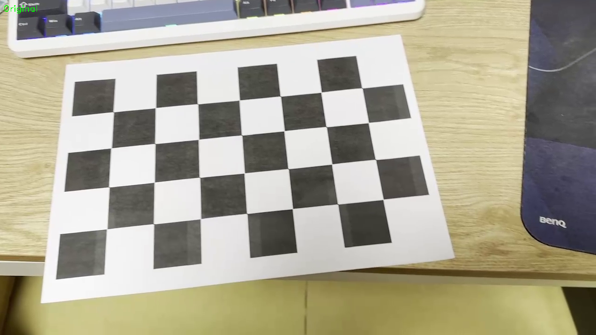
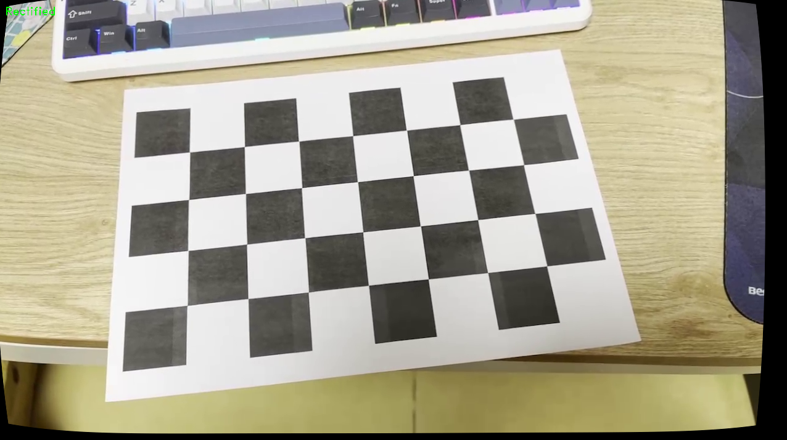

# my_camera_calibration
Simple camera calibration demo with python

## Camera Calibration Results

- **Number of selected images**: 12  
- **RMS reprojection error**: 0.5555

### Camera Matrix (K)
[[1.17206568e+03, 0, 6.67272584e+02],
[0, 1.16007954e+03, 3.53480863e+02],
[0, 0, 1]]

### Distortion Coefficients (k1, k2, p1, p2, k3)
[ 0.23295006, -0.9742486, 0.00284231, 0.01000011, 0.50947765 ]

- **Focal Lengths (fx, fy)**:  
  fx = 1172.07, fy = 1160.08

- **Principal Point (cx, cy)**:  
  cx = 667.27, cy = 353.48

---

## Lens Distortion Correction
- 
- 